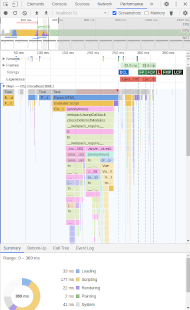
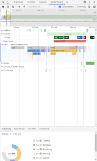

# Isomorphic applications

---

## Benefits

* SEO improvements
* Performance benefits

Note:
* SPAs are difficult for search-engine bots to crawl, don’t load the data for the app until after the JavaScript has run in the browser
* No guarantee that any page content that relies on API calls will be run by the crawlers
* In isomorphic apps, the content is rendered by the server

----

### Performance

|SPA|Isomorphic app|
|---|---|
|||

* Lighthouse
* [PageSpeed Insights](https://developers.google.com/speed/pagespeed/insights/)

Note:
* FP: First Paint
* FCP: First Contentful Paint
* LCP: Largest Contentful Paint

---

## References

----

### Books

* [Isomorphic web applications](https://www.manning.com/books/isomorphic-web-applications?query=isomo)
* [Express in action](https://www.manning.com/books/express-in-action?query=express)

